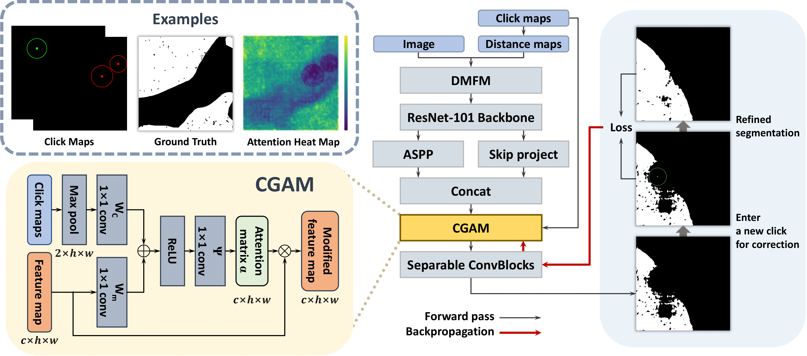

## CGAM: click-guided attention module for interactive pathology image segmentation via backpropagating refinement

> **CGAM: click-guided attention module for interactive pathology image segmentation via backpropagating refinement**<br>
> [Seonghui Min](https://scholar.google.co.kr/citations?user=iBOHogcAAAAJ&hl=ko&oi=ao), [Won-Ki Jeong](https://scholar.google.com/citations?user=bnyKqkwAAAAJ&hl=ko&oi=ao)<br>
___
[[Paper](https://arxiv.org/pdf/2307.01015)]



#### Implementation
- Requirements
```
pip install -r requirements.txt
```

#### Acknowledgement
Our code is developed based on [f-BRS: Rethinking Backpropagating Refinement for Interactive Segmentation](https://github.com/SamsungLabs/fbrs_interactive_segmentation).

#### Citation
Please cite us if you use our work